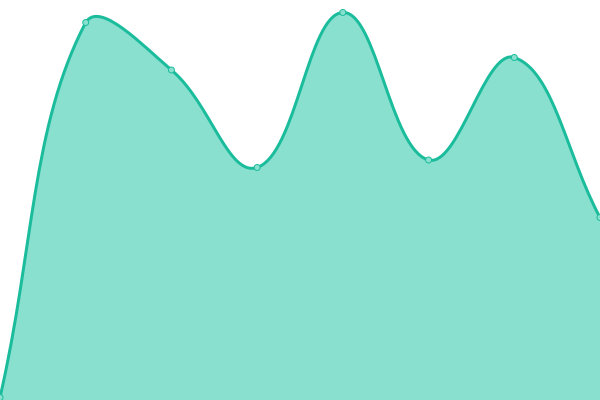
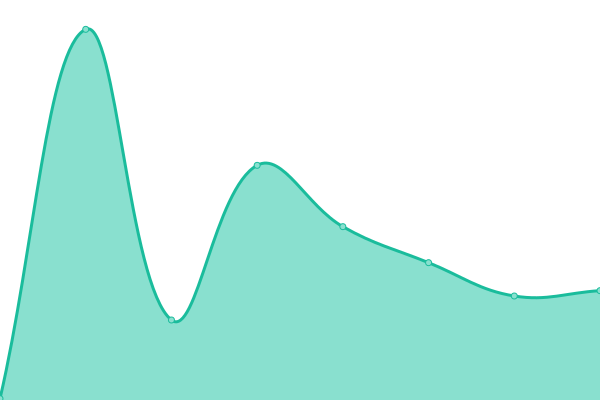
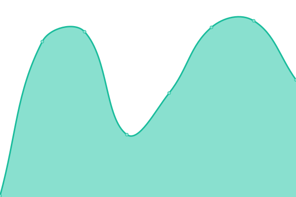
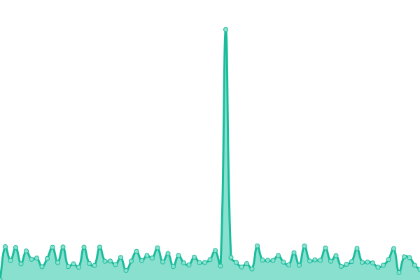

# [📈 Live Status](https://sdcagroup.github.io/SiteCheck): <!--live status--> **🟧 Partial outage**

This repository contains the open-source uptime monitor and status page for [sdcagroup](https://sdcagroup.github.io/SiteCheck), powered by [Upptime](https://github.com/upptime/upptime).

With [Upptime](https://upptime.js.org), you can get your own unlimited and free uptime monitor and status page, powered entirely by a GitHub repository. We use [Issues](https://github.com/sdcagroup/SiteCheck/issues) as incident reports, [Actions](https://github.com/sdcagroup/SiteCheck/actions) as uptime monitors, and [Pages](https://sdcagroup.github.io/SiteCheck) for the status page.

<!--start: status pages-->
<!-- This summary is generated by Upptime (https://github.com/upptime/upptime) -->
<!-- Do not edit this manually, your changes will be overwritten -->
<!-- prettier-ignore -->
| URL | Status | History | Response Time | Uptime |
| --- | ------ | ------- | ------------- | ------ |
|  [Holly North](https://hollynorth.com) | 🟥 Down | [holly-north.yml](https://github.com/sdcagroup/SiteCheck/commits/HEAD/history/holly-north.yml) | 

 141ms
     
 | 

<a href="https://sdcagroup.github.io/SiteCheck/history/holly-north">0.00%</a>
    

|  [Hoop Tape](https://hooptapecanada.com) | 🟥 Down | [hoop-tape.yml](https://github.com/sdcagroup/SiteCheck/commits/HEAD/history/hoop-tape.yml) | 

 152ms
     
 | 

<a href="https://sdcagroup.github.io/SiteCheck/history/hoop-tape">100.00%</a>
    

|  [Sicom](https://sicomindustries.com) | 🟥 Down | [sicom.yml](https://github.com/sdcagroup/SiteCheck/commits/HEAD/history/sicom.yml) | 

 131ms
     
 | 

<a href="https://sdcagroup.github.io/SiteCheck/history/sicom">100.00%</a>
    

|  [The Tickle Trunk](https://thetickletrunk.com) | 🟩 Up | [the-tickle-trunk.yml](https://github.com/sdcagroup/SiteCheck/commits/HEAD/history/the-tickle-trunk.yml) | 

 456ms
     
 | 

<a href="https://sdcagroup.github.io/SiteCheck/history/the-tickle-trunk">81.45%</a>
    

|  [Stu Bell](https://stubell.com.com) | 🟩 Up | [stu-bell.yml](https://github.com/sdcagroup/SiteCheck/commits/HEAD/history/stu-bell.yml) | 

 132ms
     
 | 

<a href="https://sdcagroup.github.io/SiteCheck/history/stu-bell">100.00%</a>
    

<!--end: status pages-->

[**Visit our status website →**](https://sdcagroup.github.io/SiteCheck)

## 📄 License

- Powered by: [Upptime](https://github.com/upptime/upptime)
- Code: [MIT](./LICENSE) © [Anand Chowdhary](https://anandchowdhary.com), supported by [Pabio](https://pabio.com)
- Data in the `./history` directory: [Open Database License](https://opendatacommons.org/licenses/odbl/1-0/)
